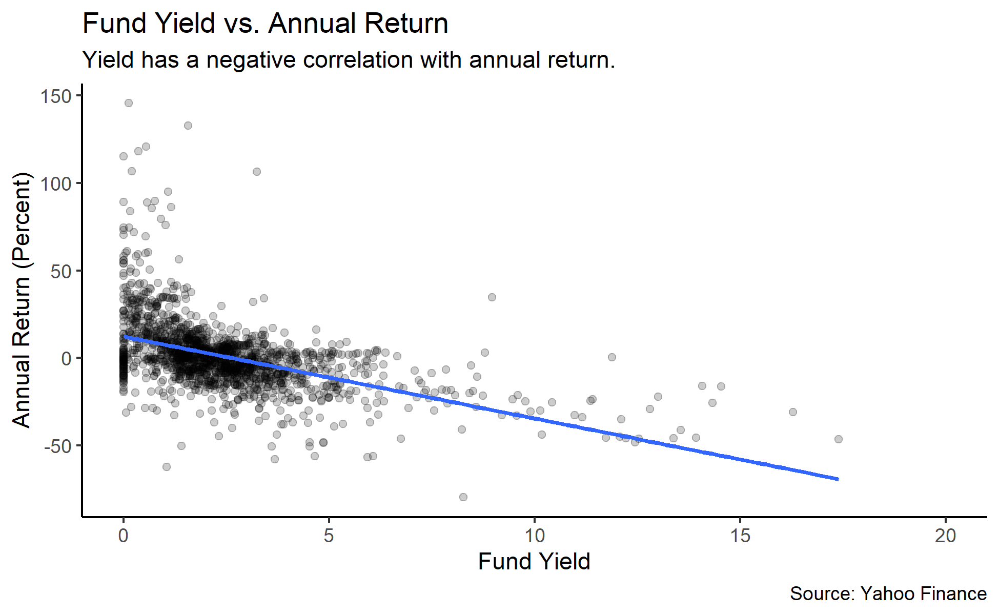
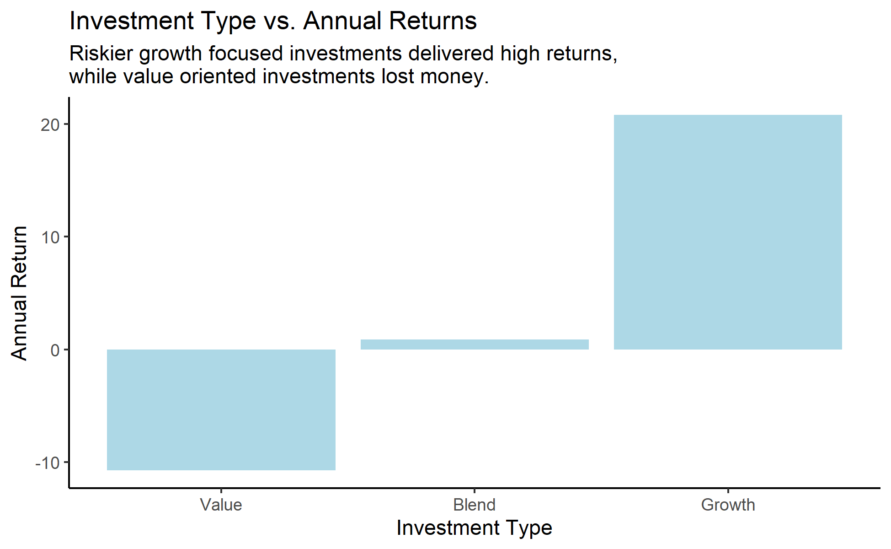

```{r setup, include=FALSE}
knitr::opts_chunk$set(echo = FALSE)
library(tidyverse)
library(ggdist)
library(distill)
library(knitr)
```

```{r, include = FALSE}
x <- read_csv("ETFs.csv", col_types = cols(
  fund_symbol = col_character(),
  fund_extended_name = col_character(),
  fund_family = col_character(),
  inception_date = col_date(format = ""),
  category = col_character(),
  investment_strategy = col_character(),
  investment_type = col_character(),
  size_type = col_character(),
  currency = col_character(),
  fund_net_annual_expense_ratio = col_double(),
  category_net_annual_expense_ratio = col_double(),
  asset_stocks = col_double(),
  asset_bonds = col_double(),
  price_earnings_ratio = col_double(),
  price_book_ratio = col_double(),
  price_sales_ratio = col_double(),
  price_cashflow_ratio = col_double(),
  sector_basic_materials = col_double(),
  sector_consumer_cyclical = col_double(),
  sector_financial_services = col_double(),
  sector_real_estate = col_double(),
  sector_consumer_defensive = col_double(),
  sector_healthcare = col_double(),
  sector_utilities = col_double(),
  sector_communication_services = col_double(),
  sector_energy = col_double(),
  sector_industrials = col_double(),
  sector_technology = col_double(),
  credit_us_government = col_double(),
  credit_aaa = col_double(),
  credit_aa = col_double(),
  credit_a = col_double(),
  credit_bbb = col_double(),
  credit_bb = col_double(),
  credit_b = col_double(),
  credit_below_b = col_double(),
  credit_other_ratings = col_double(),
  net_asset_value = col_double(),
  fund_yield = col_double(),
  top10_holdings = col_character(),
  fund_return_ytd = col_double(),
  category_return_ytd = col_double(),
  fund_return_1month = col_double(),
  category_return_1month = col_double(),
  fund_return_3months = col_double(),
  category_return_3months = col_double(),
  fund_return_1year = col_double(),
  category_return_1year = col_double(),
  fund_return_3years = col_double(),
  category_return_3years = col_double(),
  fund_return_5years = col_double(),
  category_return_5years = col_double(),
  fund_return_10years = col_double(),
  category_return_10years = col_double(),
  fund_return_2019 = col_double(),
  category_return_2019 = col_logical(),
  fund_return_2018 = col_double(),
  category_return_2018 = col_logical(),
  fund_return_2017 = col_double(),
  category_return_2017 = col_logical(),
  fund_return_2016 = col_double(),
  category_return_2016 = col_logical(),
  fund_return_2015 = col_double(),
  category_return_2015 = col_double(),
  fund_return_2014 = col_double(),
  category_return_2014 = col_double(),
  fund_return_2013 = col_double(),
  category_return_2013 = col_double(),
  fund_return_2012 = col_double(),
  category_return_2012 = col_double(),
  fund_return_2011 = col_double(),
  category_return_2011 = col_double(),
  fund_return_2010 = col_double(),
  category_return_2010 = col_double(),
  years_up = col_double(),
  years_down = col_double(),
  fund_alpha_3years = col_double(),
  category_alpha_3years = col_double(),
  fund_alpha_5years = col_double(),
  category_alpha_5years = col_double(),
  fund_alpha_10years = col_double(),
  category_alpha_10years = col_double(),
  fund_beta_3years = col_double(),
  category_beta_3years = col_double(),
  fund_beta_5years = col_double(),
  category_beta_5years = col_double(),
  fund_beta_10years = col_double(),
  category_beta_10years = col_double(),
  fund_mean_annual_return_3years = col_double(),
  category_mean_annual_return_3years = col_double(),
  fund_mean_annual_return_5years = col_double(),
  category_mean_annual_return_5years = col_double(),
  fund_mean_annual_return_10years = col_double(),
  category_mean_annual_return_10years = col_double(),
  fund_r_squared_3years = col_double(),
  category_r_squared_3years = col_double(),
  fund_r_squared_5years = col_double(),
  category_r_squared_5years = col_double(),
  fund_r_squared_10years = col_double(),
  category_r_squared_10years = col_double(),
  fund_standard_deviation_3years = col_double(),
  category_standard_deviation_3years = col_double(),
  fund_standard_deviation_5years = col_double(),
  category_standard_deviation_5years = col_double(),
  fund_standard_deviation_10years = col_double(),
  category_standard_deviation_10years = col_double(),
  fund_sharpe_ratio_3years = col_double(),
  category_sharpe_ratio_3years = col_double(),
  fund_sharpe_ratio_5years = col_double(),
  category_sharpe_ratio_5years = col_double(),
  fund_sharpe_ratio_10years = col_double(),
  category_sharpe_ratio_10years = col_double(),
  fund_treynor_ratio_3years = col_double(),
  category_treynor_ratio_3years = col_double(),
  fund_treynor_ratio_5years = col_double(),
  category_treynor_ratio_5years = col_character(),
  fund_treynor_ratio_10years = col_double(),
  category_treynor_ratio_10years = col_double()
))
```

# What ETF manager would provide the highest returns?

```{r manager-plot, echo = FALSE}
manager_plot <- read_rds("manager-plot.rds")
ggsave("manager-plot.png", plot = manager_plot)
include_graphics("manager-plot.png")
```

ARK ETF Trust outperformed the other ETF funds in the past year. This fund focuses on disruptive innovation.

# Does the fund's yield correlate to higher returns? 

```{r yield-plot, warning = FALSE, echo = FALSE} 
yield_plot <- read_rds("yield-plot.rds")
ggsave("yield-plot.png", plot = yield_plot)

```

A form of investing called dividend investing has been on the rise lately, with people investing to instead maximize dividends. A fund's yield (the income generated to investors through interest and dividends) has a negative correlation with returns.
This is understandable, as often times a company the fund is invested in would offer dividends to make up for the lack of returns.

# What sector performed the best in the short-term?

```{r sector-short-plot, echo = FALSE}
sector_short_plot <- read_rds("sector-short-plot.rds")
ggsave("sector-short-plot.png", plot = sector_short_plot)
include_graphics("sector-short-plot.png")
```
In the shorterm many sectors were less than or near 0% returns. A few (most notably, the technology sector) surpassed the benchmark of the S&P 500 (the blue line, ~10% returns), which tracks the performance of the top 500 companies.

# What sector performed the best in the long-term?

```{r sector-long-plot, echo = FALSE}
sector_long_plot <- read_rds("sector-long-plot.rds")
ggsave("sector-long-plot.png", plot = sector_long_plot)
include_graphics("sector-long-plot.png")
```

In the longterm most sectors had positive returns, with the exception being the Energy sector. However, compared to the average returns of the S&P 500 (~10%), most sectors lagged behind with the exception being the technology sector.
This shows that most ETFs often fail to meet the returns of the S&P 500, and that it is often a good idea to research about the S&P 500.

# How did growth ETFs compare to value ETFs in the short-term?

```{r type-short-plot, echo = FALSE}
type_short_plot <- read_rds("type-short-plot.rds")
ggsave("type-short-plot.png", plot = type_short_plot)

```

Growth focused investing focuses on investments that have the future potential to outperform the overall market. Value focused investing focuses on investments that are currently undervalued, trading below what they are really worth. During the past year, value ETFs has negative returns while growth ETFs had positive returns.

# How did growth ETFs compare to value ETFs in the long-term?

```{r type-long-plot, echo = FALSE}
type_long_plot <- read_rds("type-long-plot.rds")
ggsave("type-long-plot.png", plot = type_long_plot)
include_graphics("type-long-plot.png")
```

Averaging out the past 5 years, value ETFs had next to no returns allowing it to only hedge against inflation, while growth ETFs had significantly higher returns.

# What ETF investments performed the best?

Overall, the ETFs that have best performed in the past year were growth focused investments in the technology sector.
Due to the pandemic, there was immense growth in the technology sector during the past year as people moved to a digital environment. However, the technology sector still outperformed the rest of the sectors during the past 5 years. ARK was a popular fund that created many high-performing ETFs, beating the returns of other funds.

**Historical returns do not guarantee future returns.** This analysis is meant for educational purposes only, and should not be taken as financial advice.

